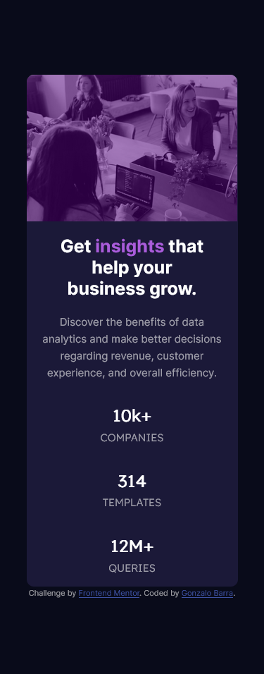
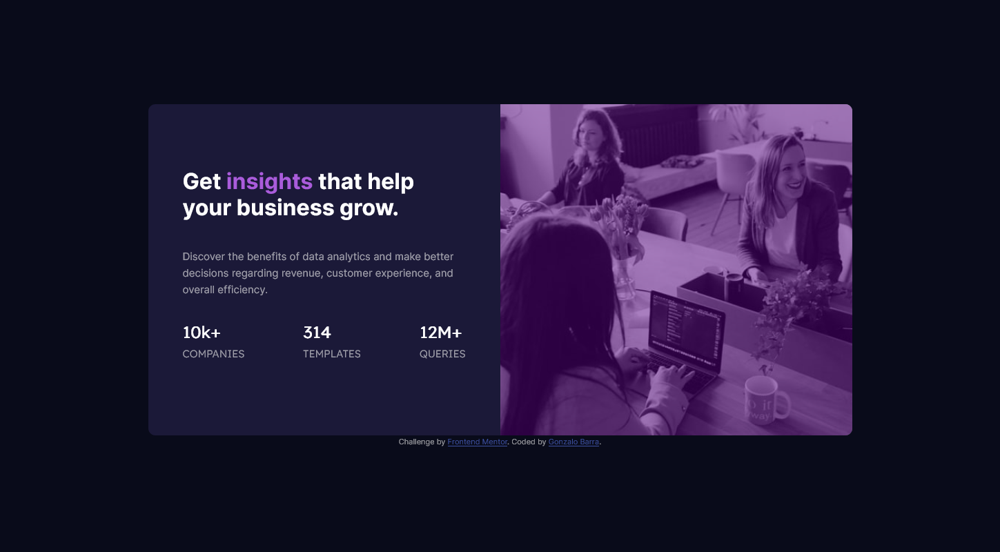

# Frontend Mentor - Stats preview card component solution

This is a solution to the [Stats preview card component challenge on Frontend Mentor](https://www.frontendmentor.io/challenges/stats-preview-card-component-8JqbgoU62). Frontend Mentor challenges help you improve your coding skills by building realistic projects.

## Table of contents

- [Overview](#overview)
  - [The challenge](#the-challenge)
  - [Screenshot](#screenshot)
  - [Links](#links)
- [My process](#my-process)

  - [Built with](#built-with)
  - [What I learned](#what-i-learned)
  - [Useful resources](#useful-resources)
 

- [Author](#author)

## Overview

### The challenge

Users should be able to:

- View the optimal layout depending on their device's screen size

### Screenshot




### Links

- Solution URL: [https://github.com/Gonzalo-Barra/stats-preview](https://github.com/Gonzalo-Barra/stats-preview)
- Live Site URL: [https://gonzalo-barra.github.io/stats-preview/](https://gonzalo-barra.github.io/stats-preview/)

## My process

### Built with

- Semantic HTML5 markup
- CSS custom properties
- Flexbox
- Mobile-first workflow
- [Vue.js](https://vuejs.org/) - JS library

**Note: These are just examples. Delete this note and replace the list above with your own choices**

### What I learned

Using Vue with Vite, and configure the basics of a project.

### Useful resources 

- [Vite docs](https://vitejs.dev/guide/) 
- [Flex W3School](https://www.w3schools.com/css/css3_flexbox.asp) 

## Author

- Website - [Gonzalo Barra Github](https://github.com/Gonzalo-Barra)
- Frontend Mentor - [@Gonzalo-Barra](https://www.frontendmentor.io/profile/Gonzalo-Barra)

```

```
